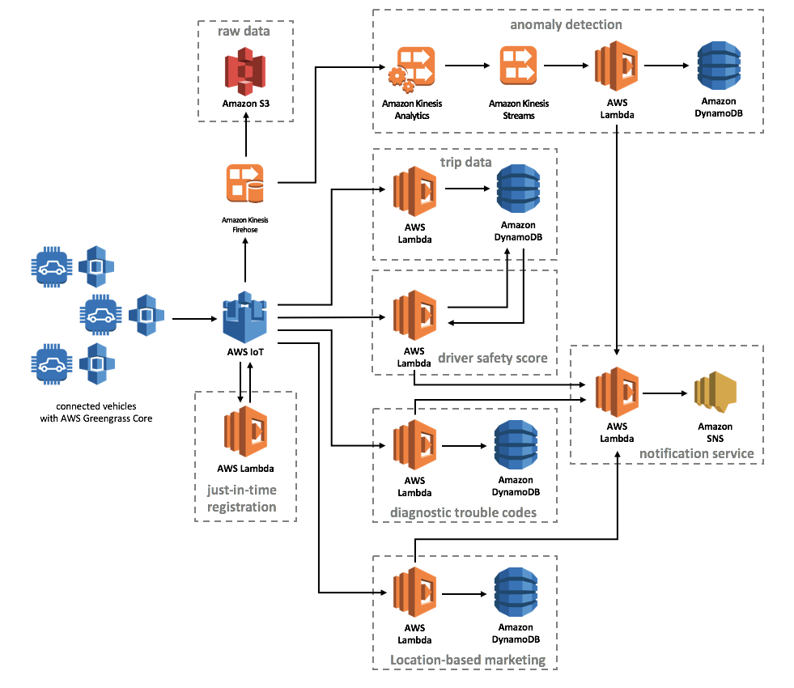
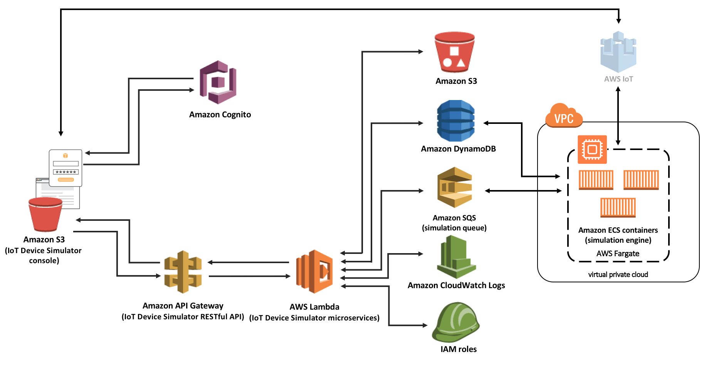

# AMT303 Deep Dive into the AWS Connected Vehicle Reference Solution Workshop
During this Workshop, we'll take a deep dive into the AWS Connected Vehicle Reference Architecture (CVRA). Attendees will install it, build functions on top of the CVRA including an Alexa Skill, generate trip data from a simulated vehicles, and learn how the data can be accessed with various other AWS services.

#### Prerequisites
We'll assume that you have some basic knowledge of AWS services like IAM, CloudFormation, DynamoDB, S3, IoT, etc., are comfortable using the AWS CLI, and have some knowledge of Python and Node.js. You'll also need to prepare the following for
the workshop (can be done in Cloud9 or on your local machine):
* Laptop running Windows or MacOS and Google Chrome or Mozilla Firefox (Safari, Internet Explorer, or Microsoft Edge are not recommended)
* An AWS account with Administrator Access
* The AWS CLI, configured with a user that has Administrator Access ([directions here](https://docs.aws.amazon.com/cli/latest/userguide/installing.html))
* Python, Virtualenv, git and npm installed
* A HERE Maps app_code and app_id (register for a free account at [https://aws.amazon.com/marketplace/pp/B07JPLG9SR](https://aws.amazon.com/marketplace/pp/B07JPLG9SR))
* Mapbox Account (you will need a Token for the IoT Simulator) [http://mapbox.com](http://mapbox.com)

Due to AWS Service availability in certain Regions we recommend you use the **US-EAST-1** region for this workshop. If the us-east-1 region is not the default region for your profile we suggest setting AWS_DEFAULT_REGION=us-east-1 for this workshop.

## Introduction
This Workshop has five main sections which are listed below. The intent of this Workshop is to help attendees understand what's "under the hood" of the CVRA and the IoT Device Simulator so that they can modify and extended it to for their use cases.

1. Deploy the CVRA and IoT Device Simulator (15 mins)
3. Build a Fleet Management Function (25 mins)
4. Generate Trip Data (5 mins)
5. Deploy the ConnectedCar Alexa Skill (30 mins)
6. Build the Remote Command function (30 mins)
7. Cleanup

> If you have established an AWS account within the last 12 months, then this lab will be in the free tier. Otherwise, costs are anticipated to be less than $5.
For the AMT303 workshop we will be providing Credits to covers costs at the end of the workshop.

This workshop has been written as modular and therefore after deploying the CVRA and the IoT Device Simulator each exercise is independent.
---

## Cloud9 Preparation Steps (Optional)
> We recommend using a Cloud9 instance (hosted IDE) for the next steps, as it is bandwidth-friendly and helpful during troubleshooting!
> Cloud9 is free-tier eligible

Next, clone the git repository for this bootcamp:
```bash
git clone https://github.com/dixonaws/reinvent_cvra_bootcamp
```

You should now have a new directory, *reinvent_cvra_bootcamp* in your work directory. Third, complete the
worksheet below *or*, if you are on macOS/Cloud9, you can use a utility in the reinvent_cvra_bootcamp to
check versions and create worksheet (called worksheet.txt) for you:
```bash
chmod +x create_worksheet.sh
./create_worksheet.sh
```

***Now, you're ready to move on to Step 1 and deploy the Connected Vehicle Reference Architecture***

---

## Step 1. Deploy the CVRA and IoT Device Simulator
### Deploying the CVRA
Let's deploy the Connected Vehicle Reference Architecture (CVRA).

>Note: Detailed documentation including an implementation guide on the CVRA can be found on the https://docs.aws.amazon.com website using the following link [Connected Vehicle Solution](https://docs.aws.amazon.com/solutions/latest/connected-vehicle-solution/welcome.html).*

#### Instructions

1. To deploy the CRVA into your account click the following link [cvra-cloudformation.yaml](https://us-east-1.console.aws.amazon.com/cloudformation/home?region=us-east-1#/stacks/create/review?templateURL=https://s3.amazonaws.com/cvra-deepdrive-us-east-1-683617902415/cvra-cloudformation.yaml&stackName=cvra), this will open the CloudFormation template into your account.

If you are not already logged into your AWS Console you will need to log in with the AWS Account Credentials which you will want to use for this workshop.

2. Accept all the defaults and click **Next**
3. Tick the acknowledge box at the bottom of the page and click on **Create**

The CVRA Stack will now deploy, you can check its status via the AWS Console Page. Once the Stacks completes successfully, you can move on to the next step.

The below image shows the AWS Services and functions that are deployed as part of the CVRA.



*Now, you can move on to the next step and deploy the IoT Device Simulator*

---

### Deploying the IoT Device Simulator
In this section, you'll install and configure the AWS IoT Device Simulator and use the Automotive module to generate trip data into the Connected Vehicle Reference Architecture.

For your reference information on the IoT Device Simulator can be found using the below links:

* [Overview of the IoT Device Simulator](https://aws.amazon.com/answers/iot/iot-device-simulator/)
* [Documentation of the IoT Device Simulator](https://docs.aws.amazon.com/solutions/latest/iot-device-simulator/welcome.html)

#### Instructions

1. Download the IoT Device Simulator CloudFormation template using the following link [iot-device-simulator.yaml](iot-device-simulator.yaml).
2. From the AWS Console select **CloudFormation** from the services menu.

> Note. Please make sure you are in the US-EAST-1 region.

3. Click on **Create Stack**
4. Select the **Upload a template to Amazon S3** radio button and then click **Choose File** and select the iot-device-simulator.yaml file you download from Step 1.
5. Click **Next**
6. Name the Stack **IoT-Device-Sim**, enter your name and a email address. Click **Next**

**Please note that you will need to enter an Email address you have access to in the workshop. Once the stack has deployed you will receive an Email with login instructions for the Web portal.**

7. Accept all the defaults and click **Next**
8. Tick the acknowledge box at the bottom of the page and click on **Create**

The Stack will now deploy, you can check the status via the CloudFormation page. If the IoT Device Simulator CloudFormation Template fails to deploy due to a Permissions issue on ECS, just delete the Stack and re-deploy it again.

Once the Stack completes successfully, check your Email for the login in details. On your initial login you will be prompted to change your password. At this point it is suggested to setup the Mapbox Token within the IoT Device Simulator, for detailed instructions of how to do this [follow these instructions](/MapBox/README.md).

> Note. When you have entered the Mapbox Token into the IoT Device Simulator you will need to logout and back in again for it to take affect.

The below image shows the AWS Services used to build the IoT Device Simulator for your reference.




At this point, you can move on to the next steps where you will build a Fleet Management Function and an Alexa Skill.

---

## Building the Fleet Management Function
In this module you will create additional DynamoDB tables and a Lambda function on-top of the CVRA that will store the latest Telemetry data from the vehicles and the trip routes which can then be accessed by a Fleet Management dashboard which you will also deploy.

The following link provides the detailed instructions for the [Fleet Management](fleetManagement/README.md) module.

---

## Generate Trip Data
If you have generated trips as part of the Fleet Management module you can skip this step.

Log into the IoT Device Simulator Web Console.

*The URL and credentials would have been sent to you via an Email, the Email address is the one your defined in the Stack deployment.*

From the left hand menu select *Automotive* and select **+ Add Vehicles** at the top of the page, choose the number of vehicles you want to create and click **Sumbit**.

We suggest you provision 5 vehicles to simulate trip data. Each simulated
vehicle will travel one of several paths that have been pre-defined by the IoT
device simulator.

The CVRA expects data to be published to a topic called: `connectedcar/telemetry/<VIN>` The
device simulator allows you to simulate a number of vehicles and generate trip data.
The payload is of the form:

```json
{
  "timestamp": "2018-08-25 22:38:40.791000000",
  "trip_id": "871be6ea-4ee6-49b8-8a9b-b6ebe5050c8a",
  "vin": "9JVVV63E5NVZWH5UH",
  "name": "odometer",
  "value": 2.267
}
```

---

## Deploy the ConnectedCar Alexa Skill
Click on the link for the [Alexa Skill](AlexaSkill/README.md) workshop module instructions.

If you have skipped the Fleet Management module please make sure you follow the [instructions](#Generate-Trip-Data) to generate some trip data before you start this Alexa Skill module.

---

## Build the Remote Command Function
Click on the link for the [Remote Command](remoteCommands/README.md) workshop module instructions.

*For this module you will need to write your own Lambda functions and the instructions only provide you with code snippets*

---

## Cleanup (10 mins)
The last thing to do in this workshop is to clean up any resources that were deployed in your account.

From the AWS console, ensure that any associated S3 buckets, DynamoDB tables, and IoT service are clean.

Also be sure to delete the following:
* The Lambda function for ConnectedCar
* Delete the Fleet Management & Remote Command Function Code
* The ConnectedCar skill from developer.amazon.com


From your worksheet, delete the following Cloudformation stacks:
* Your CVRA Cloudformation stack
* Your vehicle simulator Cloudformation stack

Delete your Cloud9 instance if you created one.

```bash
aws cloudformation delete-stack --stack-name <your CVRA stack>
aws cloudformation delete-stack --stack-name <your vehicle simulator stack>
```

---

## Ideas for Customization and Enhancement
Hopefully, you were able to learn how to make use
of the data collected by a simulated connected vehicle (and ultimately any connected device). Here are some ideas to make enhancements and improvements from here:
* Enhance the Alexa skill to read values from many different cars
* Adjust the IAM roles for more granular permissions
* Develop account linking for the ConnectedCar skill to read back information only for linked VINs
* Create an authenticated API to access the VehicleTripTable (API Gateway, Lambda, Cognito)
* Enhance the ConnectedCar Alexa skill to get the latest fuel prices in a certain location
* Connect to other public APIs to enhance your Alexa skill
* Create a deployment pipeline for your Alexa skill and Lambda function
* Deploy the CVRA solution with a real vehicle, using Greengrass and an OBDII interface!
